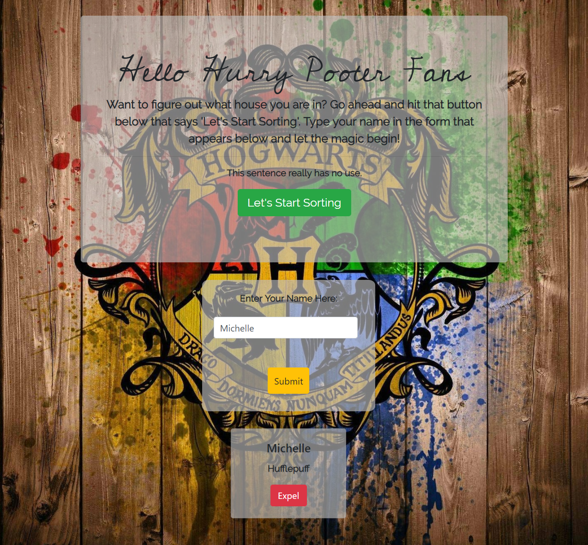

# The Sorting Hat

This project was super fun! I love Harry Potter and I purposely made my name fall upon the house I am in in my super cool screenshot. Go Badgers! In this particular project we worked with bootstrap - incorporating it into our JS and HTML. We also practiced on our event listener functions, printing to the DOM and a couple other methods like Math.floor to randomize which house you would land in. So go on, have fun. Download the terminal if you haven't already and give it a go!

# Screenshot



# How to run this project

1. Use npm to install http-server in your terminal if you have not already:
```
npm install -g http-server
```

2. Run the server: 
```
hs -p 9999
```
3. Open Chrome and navigate to:
```
localhost:9999
```